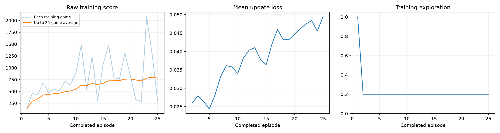
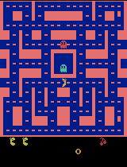
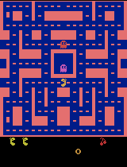

# Ms. Pac-Man DQN — Class 3 Assignment (Fundamentals of Agentic AI)

Training a small Deep Q-Network to play Ms. Pac-Man from raw pixels, using the class's [pacman-dqn](https://github.com/pepealonso95/pacman-dqn) starter notebook. This repository is my executed submission: the notebook, my hyperparameter choices, and the evidence from my run.

## Open and run

1. Clone this repository.
2. Open [`pacman_dqn.ipynb`](pacman_dqn.ipynb) in Jupyter Lab, VS Code, or Google Colab, with a Python 3.11–3.13 kernel.
3. Section 1 already contains my three chosen values (see below). Choose **Run All** — the notebook installs its own packages and detects CUDA / Apple Silicon MPS / CPU automatically.

Local setup, if you need it:

```sh
python -m venv .venv
source .venv/bin/activate        # Windows: .venv\Scripts\Activate.ps1
python -m pip install -r requirements.txt
python -m jupyter lab pacman_dqn.ipynb
```

This copy was run locally (not in Colab) on a MacBook with Apple Silicon, using MPS acceleration.

## My three hyperparameters and why

| Setting | Value | Why |
|---|---|---|
| **Exploration** | `0.20` | Kept the notebook's starting point. The lecture's example — 0% exploration "locks in a suboptimal path" — argues against going lower; 20% still leaves 80% of moves exploiting whatever the network has learned. |
| **Episodes** | `25` | Enough to cross the assignment's 25-episode threshold for intermediate GIFs/checkpoints and to produce a real (if small) number of learning updates, without an excessively long run on a laptop CPU/GPU. 5 would only check that the pipeline runs; 100 would take much longer for a first pass. |
| **Learning rate** | `0.0001` | The notebook's reference point and the lecture's example of a safe step size — small enough to avoid the "overshoots and never converges" failure mode, at the cost of needing more updates to move very far. |

I also set `SHOW_POPUPS = False` in the preview-settings cell (section 2). This only changes whether gameplay samples open in a separate desktop window versus displaying inline in the notebook — it does not touch the agent, its training, or any score. I set it because I ran the notebook end-to-end as an unattended batch job rather than clicking through cells interactively.

## What I expected vs. what happened

**Expected:** with 25 episodes (about 16,000 decisions) I expected a modest improvement over the untrained network — training-time scores looked reasonable (mean 782, several games above 1,000), so I expected that to show up in the fixed-seed evaluation too.

**Observed:** it didn't. The mean evaluation score went **down** after training, from 492.0 (untrained) to 332.0 (trained) — every one of the five evaluation games scored lower after training than the untrained network did on the same seed. I'm reporting this as-is rather than re-running to chase a better-looking number.

### All five evaluation scores (same 5 seeds, 5% exploration, both before and after — see [`results/comparison.json`](results/comparison.json))

| Seed | Before (untrained) | After (trained, 25 ep) |
|---|---|---|
| 101 | 350 | 390 |
| 202 | 500 | 460 |
| 303 | 320 | 220 |
| 404 | 800 | 300 |
| 505 | 490 | 290 |
| **Mean** | **492.0** | **332.0** |

### Training dashboard



Raw per-game training score is noisy but trends up (light blue line/orange running average); mean update loss actually **rises** slightly over the run (0.026 → 0.049) rather than falling. Neither of those training-side signals predicted the drop in the held-out evaluation score — a direct illustration of the lecture's point that lower training loss doesn't guarantee better play.

### Gameplay GIFs

| Untrained (before) | After 25 episodes (intermediate) | Best of 5, after training |
|---|---|---|
|  |  |  |

Since this run used exactly 25 training episodes, the only "intermediate" checkpoint/GIF the notebook produces is at episode 25, which is also the final episode — so the intermediate and final-training-episode samples are the same checkpoint. The "best of 5" GIF is chosen from the five post-training evaluation games by full-game score (its excerpt still only covers the first 20 seconds).

## Actual training budget

From [`results/training_summary.json`](results/training_summary.json) and [`results/config.json`](results/config.json):

- **Completed episodes:** 25 / 25 (run finished normally — not interrupted)
- **Total decisions (agent actions):** 16,260
- **Learning updates:** 3,816
- **Elapsed time:** ~105 seconds (training + periodic evaluation samples)
- **Hardware:** Apple M2 (8-core), macOS, PyTorch 2.14.0 on **MPS** (Apple GPU acceleration)
- **Software:** Python 3.13.5, Gymnasium 1.3.0, ALE 0.11.2, NumPy 2.5.3 — full list in `config.json`

Per-episode scores, steps, loss, and timing are in [`results/training.csv`](results/training.csv). No run was interrupted early, and learning updates did occur (3,816 of them) — this was a completed run with a genuine, if disappointing, result, not a setup failure.

## In plain language: observations, actions, rewards

- **Observations:** the agent doesn't see game objects or coordinates — it sees four consecutive game screens, each reduced to an 84×84 grayscale image. Stacking four frames lets the network infer motion (e.g., which way a ghost is moving) from a single snapshot in time.
- **Actions:** at each decision point the agent picks one of Ms. Pac-Man's joystick moves (up/down/left/right and diagonals/no-op, depending on the game's action set).
- **Rewards:** the reward is the raw change in the in-game score — pellets, power pellets, and eating ghosts increase it; nothing shapes or redirects this signal. During training, rewards are clipped to [-1, +1] purely to stabilize the learning update; every score reported here is the true, unclipped game score.

## One limitation

16,260 decisions and 3,816 learning updates is very small for a raw-pixel Atari agent — the original DQN paper trains on tens of millions of frames. With only a 5,000-transition replay buffer and 25 episodes, the network has barely moved from its random initialization in any way that matters for full-game play, and a 5-seed evaluation is noisy enough that this particular before/after comparison could easily flip with different seeds. This run is evidence the training pipeline works end-to-end, not evidence of a competent Pac-Man agent.

## Next experiment

I would change **only the episode budget** — from 25 to roughly 200–300 — while holding exploration (0.20) and learning rate (0.0001) fixed, to test whether an order-of-magnitude more learning updates is enough to turn the evaluation delta positive. I picked this over changing exploration or learning rate because the training curve was still visibly noisy and trending upward when the run ended at episode 25; more episodes is the most direct way to find out whether the agent was simply cut off too early, before changing anything else about how it learns.

## Repository contents

- [`pacman_dqn.ipynb`](pacman_dqn.ipynb) — the executed notebook, saved with all outputs from this run (do not clear outputs).
- `results/` — evidence copied out of the full run folder:
  - `comparison.json`, `training_summary.json`, `config.json`, `training.csv`, `training_dashboard.png`
  - `demos/untrained.gif`, `demos/intermediate_episode_0025.gif`, `demos/best_trained.gif`
- Model checkpoints (`untrained.pt`, `episode_0025.pt`, `trained.pt`, ~6.4 MB each) are **not** committed to this repository (the notebook's `.gitignore` excludes `pacman_runs/` and `*.pt`) — they remain in the full local run folder `pacman_runs/20260913_143119_738703/` alongside a ZIP of the entire run.

## Verification note inherited from the starter repo

The starter repository's own verification (see the "Verification" section it shipped with, in git history) was a 5-episode smoke test of the notebook code itself, run before I made my three choices. It is not evidence about Pac-Man performance at any episode count and is unrelated to the training results reported above, which come from my own 25-episode run.

## Sources

- [ALE installation](https://ale.farama.org/getting-started/)
- [Gymnasium Atari preprocessing](https://gymnasium.farama.org/api/wrappers/misc_wrappers/#gymnasium.wrappers.AtariPreprocessing)
- [Gymnasium frame stacking](https://gymnasium.farama.org/api/wrappers/observation_wrappers/#gymnasium.wrappers.FrameStackObservation)
- [DQN paper](https://storage.googleapis.com/deepmind-media/dqn/DQNNaturePaper.pdf)
